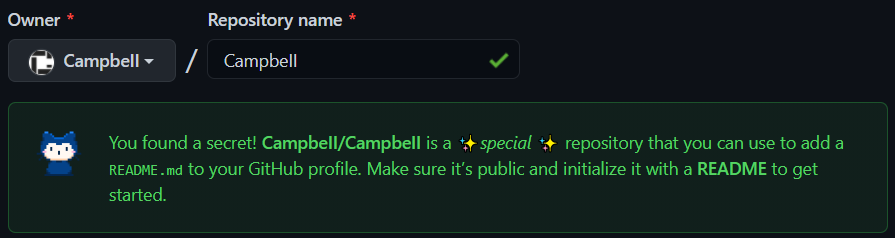
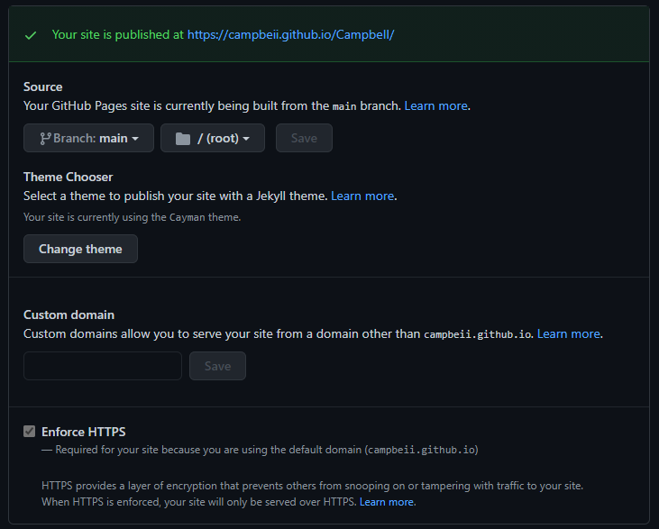

# Hosting a Portfolio with GitHub Pages
A start to finish guide on how to create, customize, and host your first portfolio piece on GitHub pages.

## What We'll Cover
- [Create a GitHub account](#0-create-a-github-account)
- [Create a secret repository](#1-create-a-special-repository)
- [Initialize GitHub pages](#2-initialize-github-pages)
- [Connect to a repository](#3-connect-to-a-repository)
- [Clone the repository](#4-clone-the-repository)
- [Customize a website](#5-customize-your-website)

## 0. Create a GitHub Account
If you haven't done so already, head to the [sign up page](https://github.com/join) and create an account.
Once finished, take some time to dig into your settings where you can change the theme, your picture, and more.

## 1. Create a Special Repository
When you use your exact username as the name of your new repo GitHub  will initialize a __special__ repo that allows you to host a website directly from your profile. Make sure that you meet the following conditions:
- [x] The repo name is the exact same as your username
- [x] You have checked the public box
- [x] You have checked "initialize with a README.md" box

If successful, you should see an image similar to below:



### 2. Initialize GitHub Pages
On GitHub open your new repo and click the "settings" button. Scroll down to where you see "GitHub Pages".

- [x] Enable GitHub Pages
- [x] Use your main branch as the source
- [x] Choose a theme
- [x] Ignore custom domain (for now)

If done properly you should see the following message. Clicking the link will take you to your new live site!



## 3. Connect to a Repository
Nothing beats the [GitHub Documentation](https://docs.github.com/en/github/authenticating-to-github/connecting-to-github-with-ssh). Head there to find the instructions for your operating system. If you aren't familiar with the command line, I recommend you download [GitHub desktop](https://desktop.github.com/) as it handles the connection for you.

## 4. Clone the Repository
This command will create a new directory on your computer using the same name as the repository.

```shell
git clone git@github.com:username/username.git
```

Sweet! Okay, we should now have the following files in our directory:

```shell
ls
README.md
_config.yml
```
`README.md` - This is a markdown file. 
It uses GitHubs' modified markdown syntax which you can read more about [here](https://docs.github.com/en/github/writing-on-github/basic-writing-and-formatting-syntax).

A README.md will be the first thing someone sees when they visit your repo. However this is a __special__ README.md file because it will show up on your profile page for everyone to see!

`_config.yml` - This is a [YAML](https://docs.ansible.com/ansible/latest/reference_appendices/YAMLSyntax.html) file. It is used to configure our theme. When you change your theme in your settings, the change will be applied here.

## 5. Customize Your Website
View your website by visiting the link specified in your settings under GitHub Pages. It typically looks like:

```shell
https://username.github.io/username
```

The first thing you will notice is that your website contains the contents of your `README.md` file along with some other automatically generated content. You can chose to continue with the template you were given, or you can build your own custom website. We're going to create a completely custom website. In order to do that, we're going to need 2 new files:

- `index.html`
- `css.css`

**Please Note:** It might take a little time for your new changes to be reflect on GitHub.

In the next lesson we're going to cover some basics of html/css and wesbite design and work on filling in our `index.html` and `css.css` files:

- [basic html layout](lessons/1/index.html#0-basic-html-layout)
- [writing performant css](lessons/1/index.html#1-writing-performant-css)
- [linking-your-css](#2-linking-your-css)
